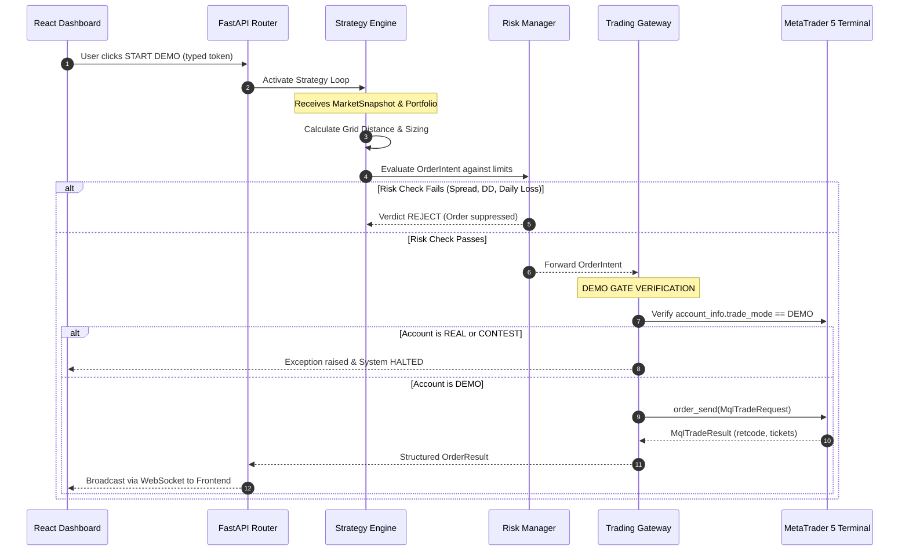

# System Architecture & Component Design

The MT5 Demo Trading Terminal is structured into modular layers, separating user interface, API routing, state management, strategy calculation, risk filtering, and hardware/broker integration.

```
                    ┌────────────────────────────┐
                    │      React Frontend        │
                    │   (Vite, Zustand, CSS)     │
                    └─────────────┬──────────────┘
                                  │ REST (127.0.0.1:8000)
                                  │ WebSocket (ws://127.0.0.1:8000/ws)
                                  ▼
                    ┌────────────────────────────┐
                    │     FastAPI Application    │
                    │ (Bearer Auth, Token Check) │
                    └─────────────┬──────────────┘
                                  │
          ┌───────────────────────┴───────────────────────┐
          ▼                                               ▼
┌──────────────────┐                            ┌──────────────────┐
│  State Machine   │                            │   Risk Manager   │
│   (BotState,     │                            │ (Daily Loss, DD, │
│ ConnectionState) │                            │  Spread, Stale)  │
└─────────┬────────┘                            └─────────┬────────┘
          │                                               │
          └───────────────────────┬───────────────────────┘
                                  │ Validated OrderIntents
                                  ▼
                    ┌────────────────────────────┐
                    │   Trading Gateway Choke    │
                    │ (Mt5Gateway / DryRunGate)  │
                    │  * Demo-Only Verification  │
                    │  * Volume Capping          │
                    │  * Retcode Analysis        │
                    └─────────────┬──────────────┘
                                  │ Windows Native IPC
                                  ▼
                    ┌────────────────────────────┐
                    │   Desktop MT5 Terminal     │
                    │      (terminal64.exe)      │
                    └─────────────┬──────────────┘
                                  │ TCP / Broker Protocol
                                  ▼
                    ┌────────────────────────────┐
                    │     Broker Demo Server     │
                    │       (XAUUSD Fills)       │
                    └────────────────────────────┘
```

---

## 1. Order Pipeline Sequence Diagram

Every entry, partial close, or basket exit follows a strict sequential pipeline with multiple defense gates:



---

## 2. State Machine Transitions

The system coordinates three orthogonal machines:
1. **ConnectionState:** `DISCONNECTED` ↔ `CONNECTING` ↔ `CONNECTED` ↔ `ERROR`
2. **BotState:**
   - `READY`: Connected, idle, ready for configuration.
   - `RUNNING`: Actively monitoring market and executing strategy entries.
   - `PAUSED`: Entries blocked; exit management (basket TP/SL) remains active.
   - `STOPPING`: Graceful shutdown requested; waiting for open tasks.
   - `EMERGENCY_STOP`: Latched kill state; entries impossible, close-all initiated, requires typed `RESET` to clear.
3. **ExecutionMode:** `DRY_RUN` (virtual fills) vs `DEMO_EXECUTION` (live orders on MT5 demo account).

---

## 3. Independent Protective Layers (Section 50)

1. **Broker-Side Protective SL:** Every order submitted includes an automatic catastrophe Stop Loss (`protective_sl_points`) placed on the broker's server. If the bot PC loses power or internet, the broker still protects the account.
2. **Account-Level Circuit Breakers:** The Risk Manager runs continuously and independently of the strategy loop. If daily loss or equity drawdown is reached, it fires an emergency halt.
3. **Watchdog EA (MQL5):** Optional terminal-side script (`mql5/Watchdog.mq5`) monitoring a Python heartbeat variable and closing positions if heartbeat is lost for >30 seconds.
